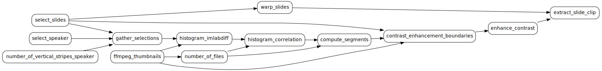

.. Livius documentation master file, created by
   sphinx-quickstart on Wed Jul 29 13:42:33 2015.
   You can adapt this file completely to your liking, but it should at least
   contain the root `toctree` directive.

Welcome to Livius's documentation!
==================================

Contents:

.. toctree::
   :maxdepth: 2

   Existing Jobs<jobs>
   Existing Workflows<workflow>
   Output video creation<final_video>
   job_interface
   example_workflow
   utilities
   Visualization utilities<visualization>
   sphinx_how_to
   
What is Livius?
===============
Livius is a small framework for making videos out of talks/presentations. It uses as input a video stream
containing all the relevant informations: slides, speaker, sounds... and applies corrections to it:

* slide contrast and aspect is corrected automatically
* speaker is tracked (in progress)
* title/epilog/credit pages may be added
* the talk duration is cropped and pauses can be added as well (in progress) 

Getting started
===============

Livius defines `workflow` and `jobs`: those are convenient tools for being able to process the videos.

* A `job` is a small processing unit that takes input and produces outputs, and maintains a state so that
  outputs are not being reprocessed if the inputs have not changed.
* A `workflow` is a set of jobs with their dependencies (which defines a Directed Acyclic Graph)

Livius already contains many different jobs as well as some workflows. 

* The available jobs are detailed here: :doc:`jobs`
* The available workflows are detailed here: :doc:`workflow`
* A workflow example is detailed here: :doc:`example_workflow`
* It is also easy to define new jobs: the job interface is detailed here: :doc:`job_interface`

Running Livius
==============
Once you know more about the workflow you want to use, you may run the processing of this 
workflow over a bunch of videos simply by running

.. code::

  cd $livius_src
  python -m SourceCode \
    --workflow=my_workflow \
    --output-folder=/a/big/disk \
    --video-folder=my_folder_full_of_videos \
    --option=meta_location=/a/folder/containing/annotations

The detailed options of Livius are given below (just type ``--help`` in the previous command line):

.. program-output:: python -m SourceCode --help
    :cwd: ../../ 

The parameter ``--option`` may be used to define additional options needed by the runtime behaviour of the Jobs. The 
parameters accepted by the jobs are described in each job documentation under the rubric **Runtime parameters**.

.. note::

   Every job in the current workflow will see all of ``--option`` settings.

Setting several parameters from the command line may be cumbersome. It is possible to pass ``--option-file`` which will
read several parameters from a json file. A default configuration file is provided as ``default_config.json``. The parameters
set by the ``--option`` may override the parameters set by the ``--option-file`` so that it is possible to override the 
default settings from the command line.

``--is_visual_test`` permits to limit the processing of the final video to 10 seconds, which may be convenient for visual checks.
However the thumbnail extraction is (currently) performed for the full video. 

``--process-only-index`` makes the command run the processing of only one video. This is convenient in case the 
processing is run on a eg. cluster and each processing of a unique video spans one process.

``--non-interactive`` might be needed in environment where no front-end interaction is possible (eg. remote session).

If you want to see more about the details of the workflow, you may use the options ``--print-workflow`` and ``--dot-workflow``
that print the selected workflow to the console, either in text or in `dot <http://www.graphviz.org/doc/info/lang.html>`_ format 
(that then may be rendered with `graphviz <http://graphviz.org/>`_). 

The following lines::

    python -m SourceCode --workflow=workflow_extract_slide_clip --dot-workflow > test.dot
    dot test.dot -Tsvg -otest.svg 

yields this:

Installation
============

For FFMpeg related processing, ``ffmpeg`` should be installed and accessible from the command line. The 
dependencies of Livius are the following (which may be installed in a virtual environment, see/search
in the wiki for more details).

.. code::

  pip install numpy matplotlib
  pip install moviepy
  
  # for the documentation
  pip install sphinx
  pip install sphinxcontrib-programoutput 
  pip install sphinx_bootstrap_theme

Font on Linux
-------------
Some specific fonts are used (see Lato font below). On Linux those fonts sa ``.ttf`` files should be installed as follow:

.. code::

  cp *.ttf $HOME/.fonts
  fc-cache -fv
  
Meta information associated to the videos
=========================================
The metadata associated to the video files describe the following:

* the title of the talk
* the speaker
* the date
* optionally an image used as introduction
* optionally the pauses and begin/end of the video 

The meta data is loaded by the Job :py:class:`Metadata <SourceCode.video.processing.jobs.meta.Metadata>`. 
If your metadata is stored in a way that differs with the expectation of 
:py:class:`Metadata <SourceCode.video.processing.jobs.meta.Metadata>`, it is easy to adapt this class to your needs.

Relocatable files
=================
The design of Livius attempts to have relocatable files, which means that the some root folder 
(eg. videos, metadata, cached values)
might be specified and changed at runtime (command line invocation) without recomputing the intermediate or final results.

With this design, it is also possible to compute the results with different machines, from the same sources, and 
having different mount points.

Available ressources
====================
The repository contains images that can be used out of the box for running Livius on videos. Those images are more or less 
related to the /Machine Learning Summer School/ (2013, 2015), but may be adapted easily.

* ``SourceCode/ressources/background_mlss2015.png`` the background image during the talk, containing visual cues 
  (grey area on which the slides and the speaker are overlayed), mainly for visual sanity check
* ``SourceCode/ressources/background_no_grey_mlss2015.png``, same as ``background_mlss2015`` without grey areas (if one
  of the stream is smaller than the target one). 
* ``SourceCode/ressources/Lato2OFL.zip`` is an archive containing the **Lato** fonts that are used by Livius (for overlaying the title
  etc.). This font was downloaded from `this <http://www.latofonts.com/lato-free-fonts/>`_ web site. It is licensed under the
  `SIL Open Font License (OFL) v1.1 <http://scripts.sil.org/cms/scripts/page.php?site_id=nrsi&id=OFL>`_ ("/The fonts can be used 
  with­out any lim­i­ta­tions for com­mer­cial and non-​​commercial pur­poses/"). 

Indices and tables
==================

* :ref:`genindex`
* :ref:`modindex`
* :ref:`search`
